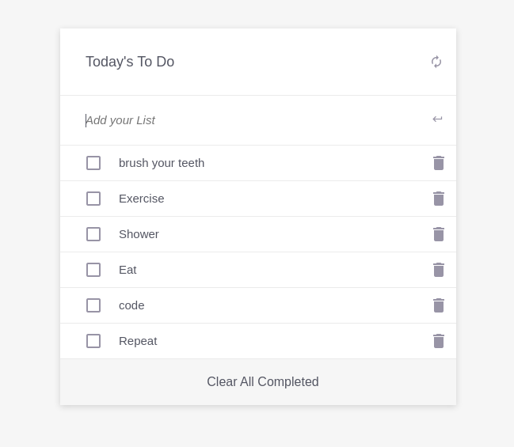

# TODO List

> An advanced Todo List web application built with pure JS, HTML & CSS 

# Preview 
 > 👀 Here is a sneak peak of how the project looks


## Built With

- HTML
- CSS
- JS
- NPM Webpacks

<hr>

## Live Demo
### Check it out and start using it right now 😍 [Click here to view Live demo](https://blessedjasonmwanza.github.io/todo-list/).

<hr>

## Getting Started
If you want a copy of this file go to the [GitHub repository](https://github.com/blessedjasonmwanza/todo-list) and download it from the link below.
- [My Microverse Project](git@github.com:blessedjasonmwanza/todo-list.git)

#### Setup
```bash
git clone git@github.com:blessedjasonmwanza/todo-list.git
cd Hello World
```
>  cd to the project directory
```bash
Open the project using a live sever extension that can be found within your code editor extensions library.
```
> install project dependencies

  ```npm install .```

> build project (not necessary, but might be needed encase going straight to starting the project fails).

  ```npm run build```

> start project

  ```npm start```

  #### Running tests
 > After installing project dependencies, run;

 ```npm run test``` 

 > ...in your bash (assuming your in the root of this project);
### Environment Prerequisites
- Web Browser
- Code editor: _[Vscode](https://code.visualstudio.com/)_ or _[Sublime Text](https://www.sublimetext.com/)_

<hr>

## 👤 Author : Blessed Jason Mwanza

- GitHub: [@blessedjasonmwanza](https://github.com/blessedjasonmwanza)
- Twitter: [@mwanzabj](https://twitter.com/mwanzabj)
- LinkedIn: [Blessedjasonmwanza](https://linkedin.com/in/blessedjasonmwanza)

<hr>


## 🤝 Contributing

Contributions, issues, and feature requests are welcome!

Feel free to check the [issues page](../../issues/).

## Show your support

Please 🙏 Please 🙏... Give a ⭐️ if you like this project!
